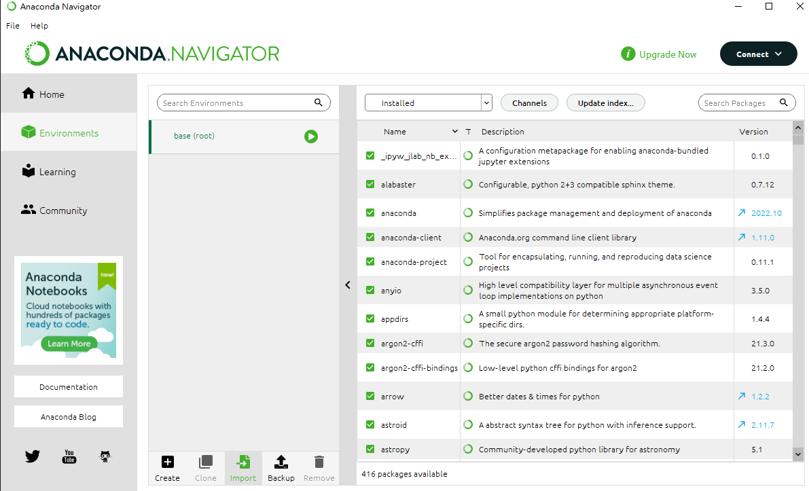
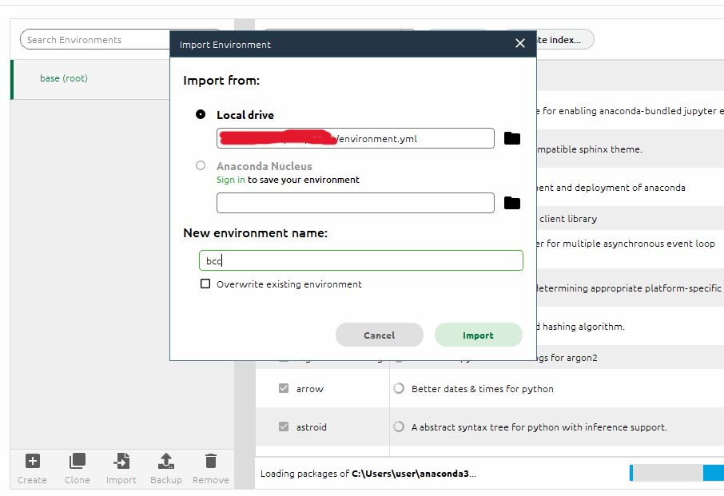

# 111-2 BCC Homework: Discord Bot

## What you need
1. Python ( 3.8+ )
    + Anaconda
    + System built-in python:
      If you know how to manage environment.
    + Microsoft Store ~~(TA hates this!)~~

2. Text Editor or IDE
    + Visual Studio Code
    + X-Code
    + ~~Notepad~~

3. Discord
    + Account
    + App

## Environment Setup

### Update to latest Anaconda 
```bash
# Open Anacaonda Prompt or your terminal
conda -V

# update the conda package manager to the latest version
conda update conda
# use conda to update Anaconda to the latest version
conda update anaconda

conda -V
```


### Anaconda GUI
1. Environment, and Import
   
2. Select `environment.yml` and naming for it
   

### Command Line

From environment.yml
```bash
$ conda env create -f environment.yml
```
Or build by your self
```bash
$ conda create -n bcc python=3.9
$ conda activate bcc
(bcc) $ pip install -U discord.py==2.2.2
(bcc) $ pip install python-dotenv
```

## Discord Developer

[Tutorial of Discord Developer]\
[Images]

## Run Bot

### Setup BOT Token
1. Create `.env` file
2. Add `DISCORD_TOKEN` to `.env`
    ```bash
    DISCORD_TOKEN="Your Token Here"
    ```

### Running 
```bash
$ conda activate bcc
(bcc) $ python3 ./template/client.py
```

## FAQ
1. How to Debug
    + Break Point
    + Read error message
    + Google

2. 環境
    + Python version
    + Activate or Not
    + 與其他 python 環境混淆

3. 權限
    + Discord Developer BOT Setup
    + Invite Link

4. PyNaCL:
    + Voice channel
    + discord.ext.commands.errors.CommandInvokeError: Command raised an exception: RuntimeError: PyNaCl library needed in order to use voice

## Notice
[TODO]
